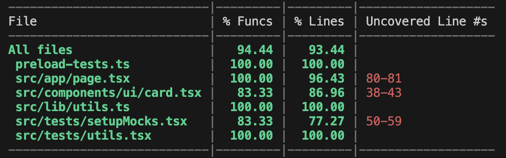

# 🍽️ Gourmitton Recipe Manager

A modern web application for managing your favorite recipes, built with Next.js, React, TypeScript, and shadcn/ui.


## ✨ Features

- 📋 Browse all available recipes
- 🔍 View detailed recipe information
- 👤 User authentication (login/logout)
- ❤️ Save your favorite recipes
- 📱 Responsive design for all devices
- 🔒 Secure API integration
- 🎨 Beautiful UI with shadcn components

## 🚀 Getting Started

### Prerequisites

- [https://bun.sh/](Bun)
- Docker (optional, for containerized deployment)

### Installation

1. Clone the repository:

```bash
git clone git@github.com:chenow/gourmitton.git
cd gourmitton
```

2. Install dependencies:

```bash
bun install
```

1. Create a `.env` file in the root directory with the following variables:

```
NEXT_PUBLIC_API_BASE_URL = "https://gourmet.cours.quimerch.com"
```

4. Start the development server:

```bash
bun dev
```

5. Open [http://localhost:3000](http://localhost:3000) in your browser to see the result.

## 🏗️ Project Structure

```
Gourmitton/src/
├── app/               # Next.js pages and routing
│   ├── /                 # Home page (recipe list)
│   ├── recettes/[id]/    # Individual recipe page
│   └── favorites/        # User's favorite recipes
├── components/           # Reusable UI components
│   ├── /                 # Reusable components
│   └── ui/               # shadcn UI components
├── context/              # React Context providers
│   └── authContext.tsx   # Authentication context
├── hooks/                # Custom React hooks
│   ├── favorites.ts      # Favorites management hooks
│   └── recipes.ts        # Recipe data fetching hooks
├── providers/            # Provider components
│   └── ReactQueryProvider.tsx # React Query configuration
├── public/               # Static assets
└── types.ts              # TypeScript type definitions
```

## 🧩 Architecture

This project follows a modern React architecture with Next.js, leveraging the power of server-side rendering and static site generation where appropriate.

### Key Technologies

- **Next.js**: For server-side rendering, routing, and API routes
- **React**: UI library for building the user interface
- **TypeScript**: Static typing for better developer experience
- **shadcn/ui**: High-quality UI components
- **React Query**: Data fetching, caching, and state management
- **Context API**: For managing application state like authentication

## 🐳 Docker Deployment

Build and run the Docker container:

```bash
docker compose up --build
```

## 🧪 Lint

Run lints with

```bash
bun lint
```

## 📦 Test

Run tests with

```bash
bun test
```

Here is the test coverage report:




## 🌐 API Integration

This application connects to the Gourmet API:
- Base URL: https://gourmet.cours.quimerch.com
- API Documentation: https://gourmet.cours.quimerch.com/swagger/index.html

